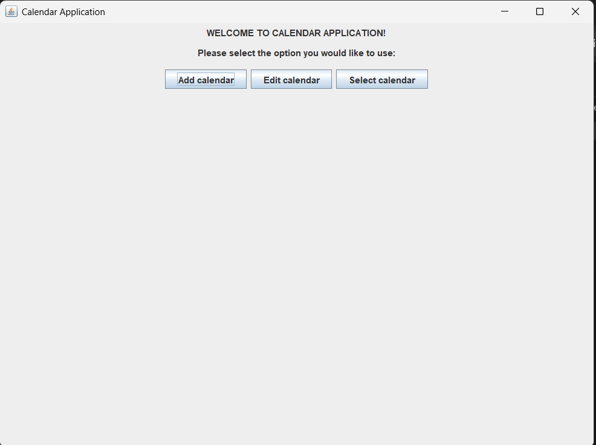
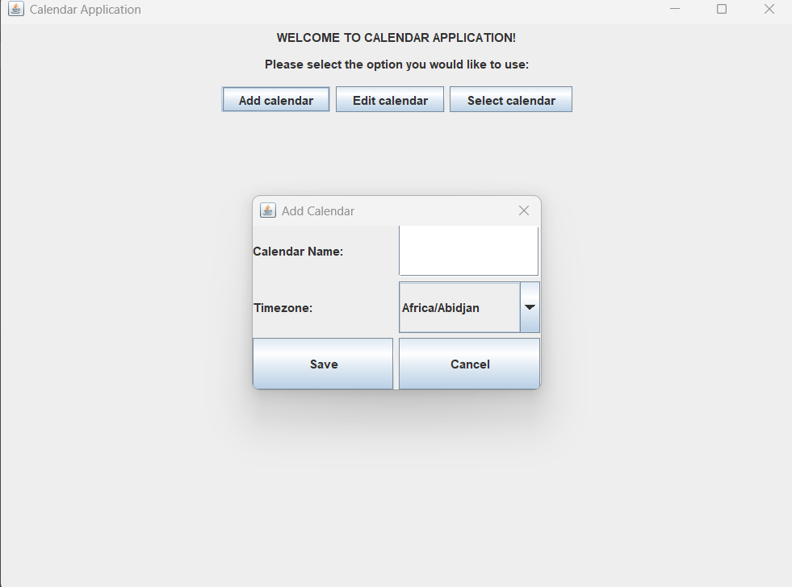
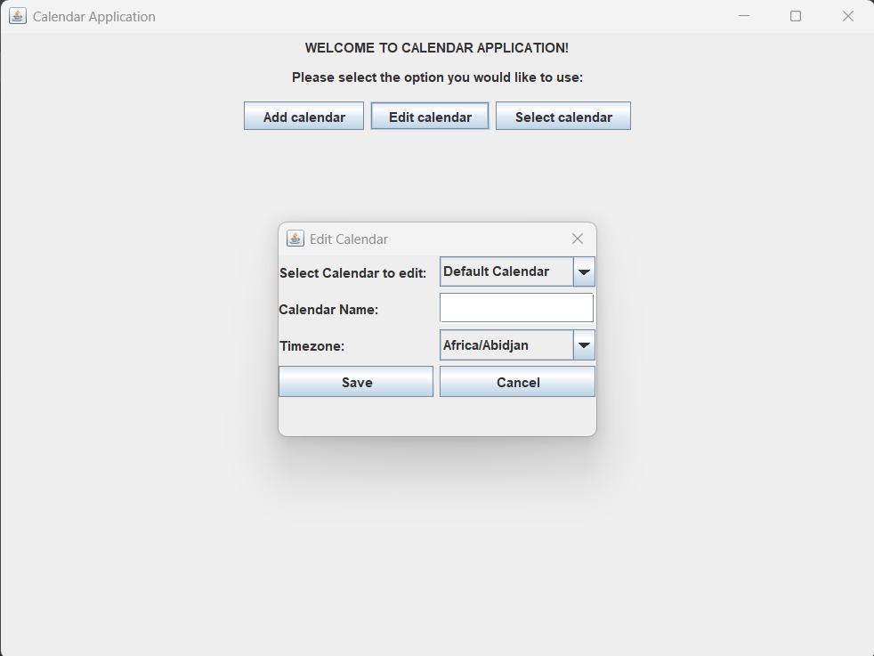
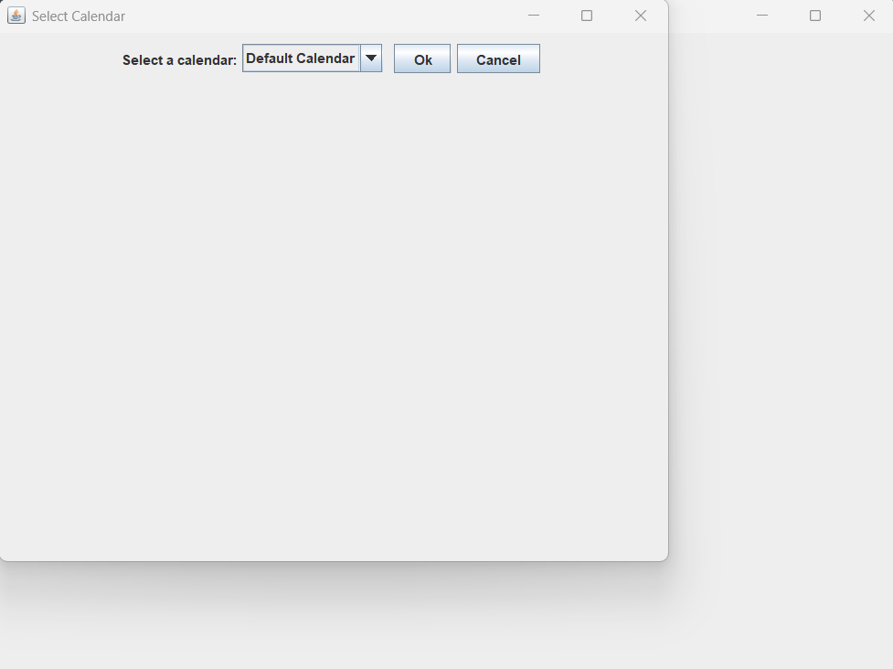
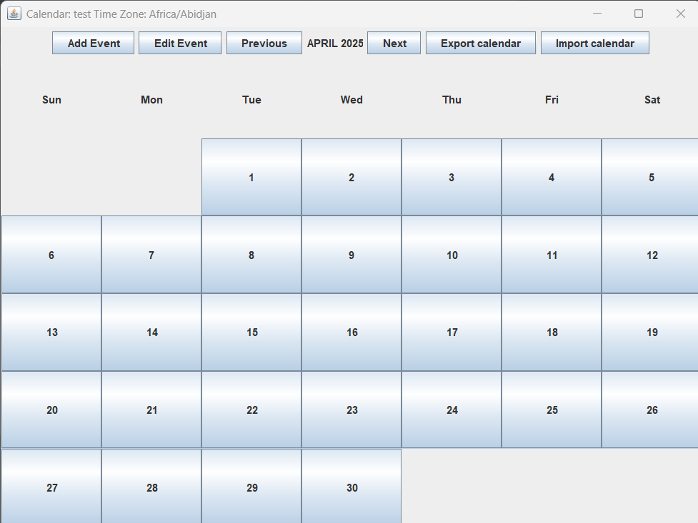
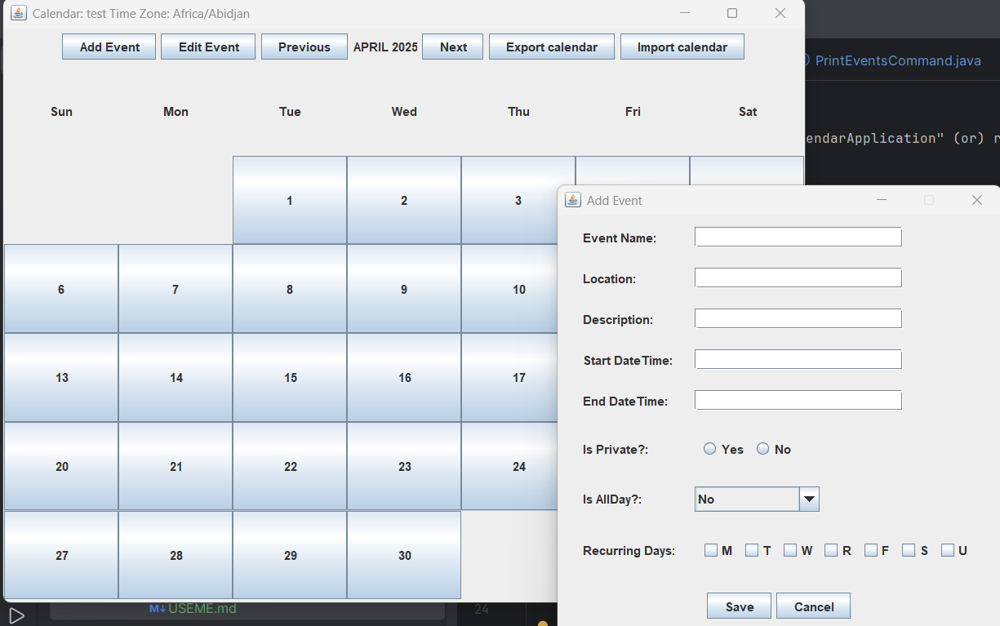
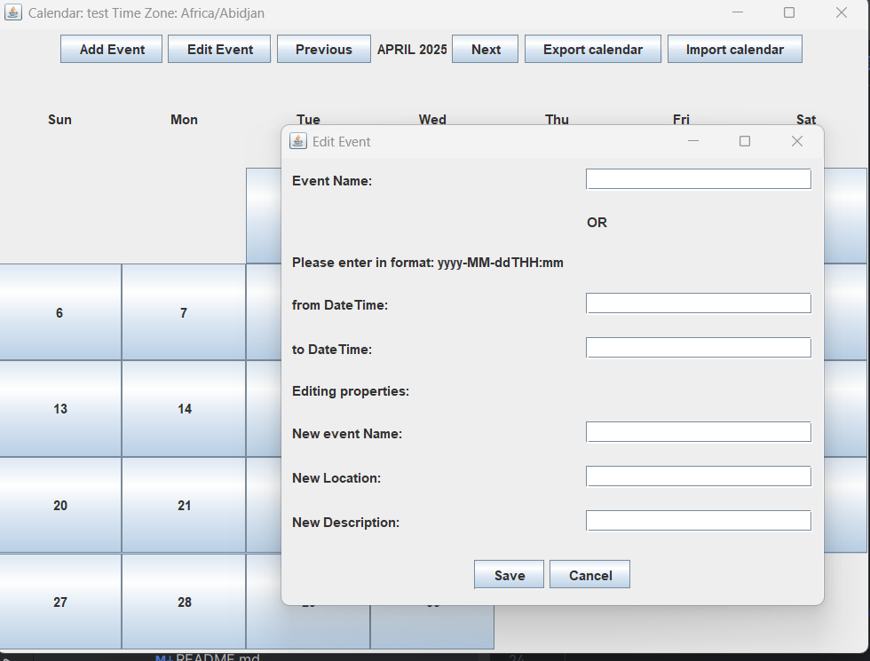
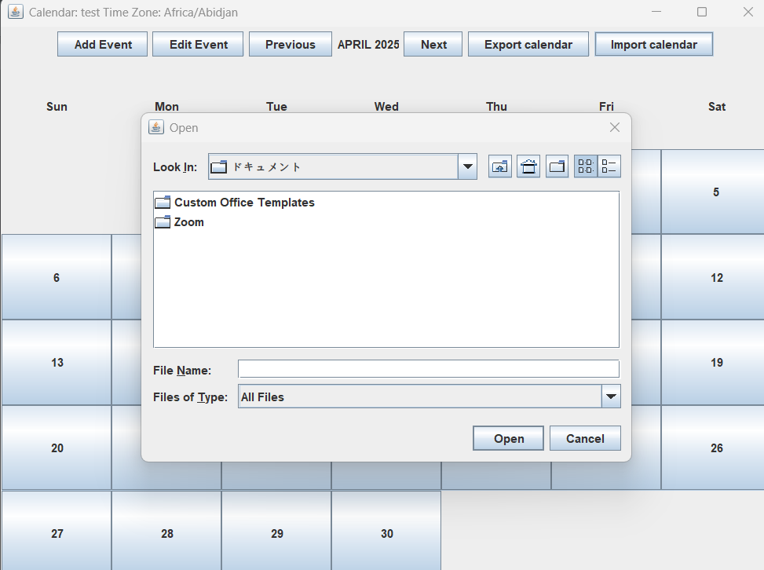
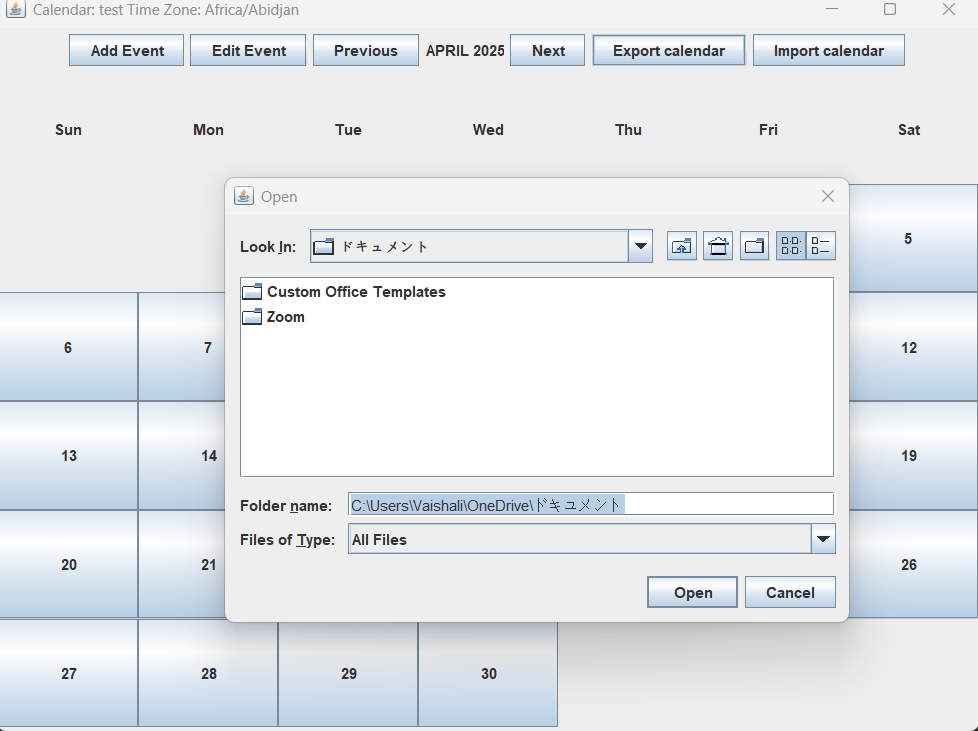
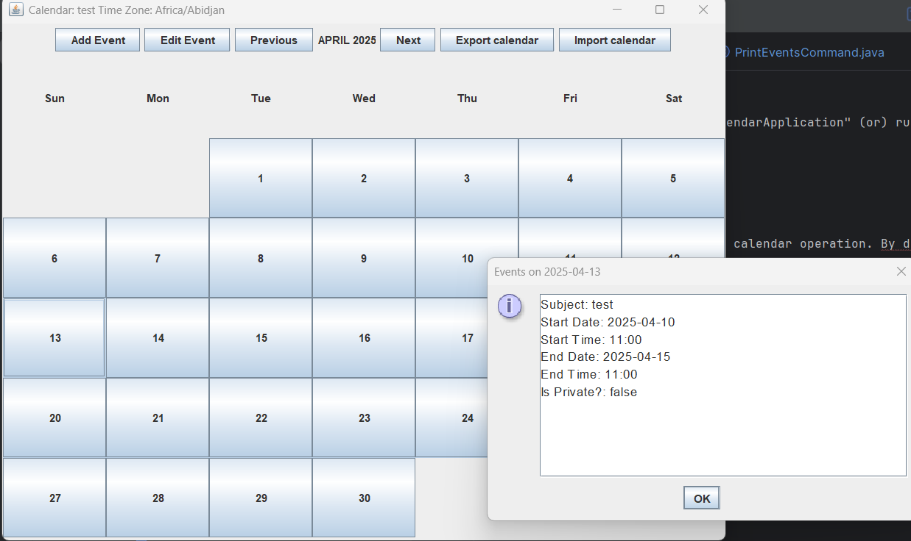

## To run the GUI

Double click on the jar named "CalendarApplication" (or) run the command "java -jar CalendarApplication.jar"

1) Home Screen will open up

You can the options to perform any calendar operation. By default a calendar named "Default Calendar" is created.

2) You can create a new calendar by clicking "Add Calendar" button.
    i) Enter name of the calendar and select the timezone fot the calendar

3) You can also edit the calendar properties by clicking "Edit Calendar" button.
   i) Select the calendar you want to edit and enter the new property in the provided space.

4) You can add event to calendars. Before adding events select the calendar you want to add events to.

5) After selecting, you can perform add event, edit event, Import event and export events. You can also view event by clicking a particular date.

6) Add Event:

7) Edit Event: 
8) Import event:
9) Export event: 
10) View event: 